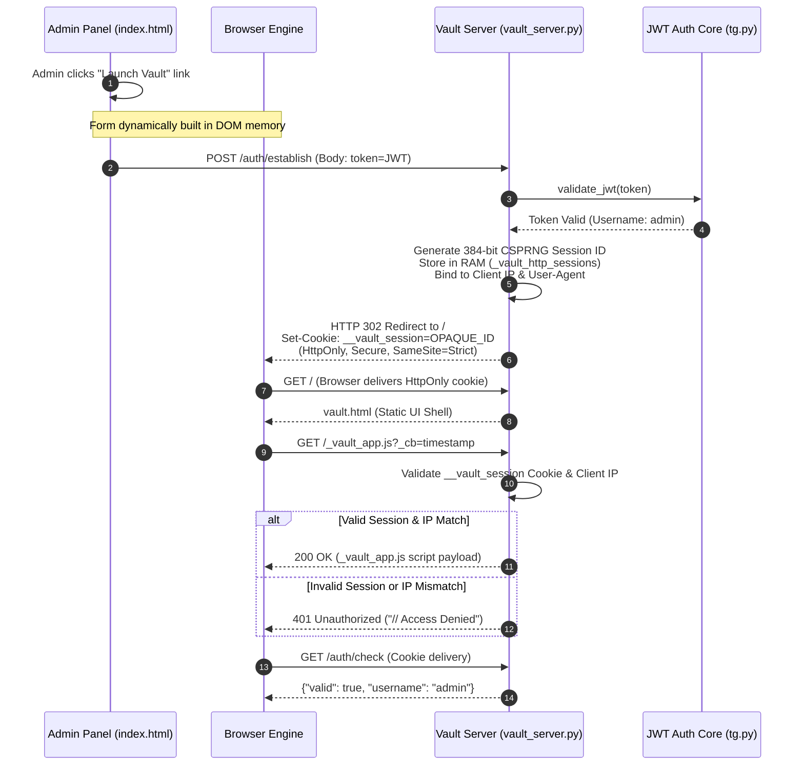
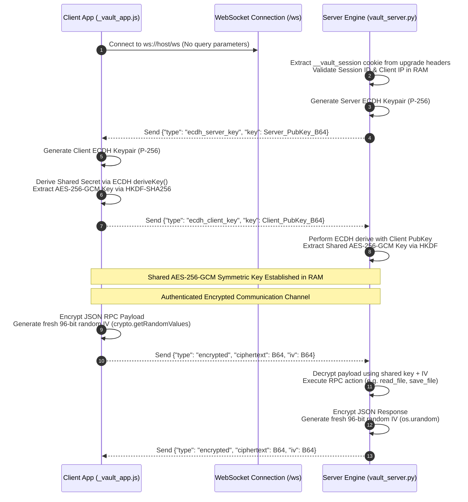
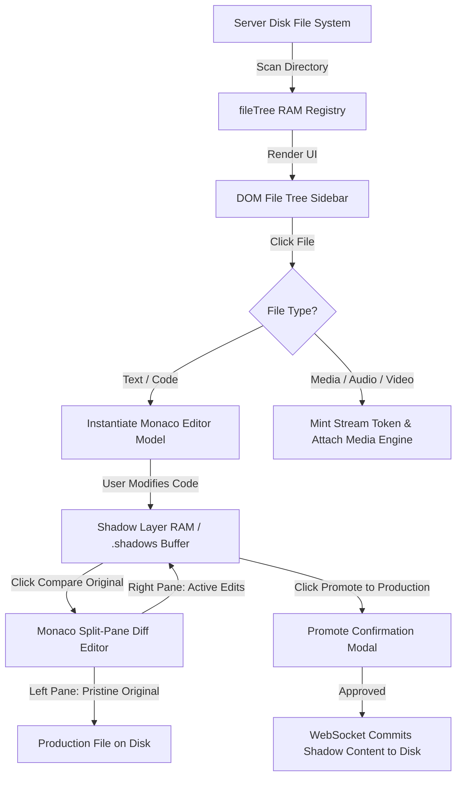
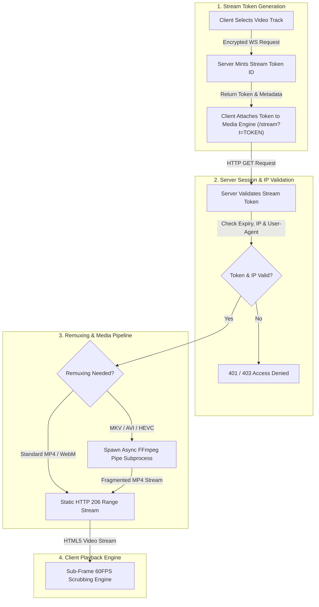

# GlyphMotion Vault Architecture, Engineering & Security Specification

**Application:** GlyphMotion Vault Studio  
**Primary Source Files:** `vault.html` (DOM/UI/CSS/SVG Definitions), `_vault_app.js` (Client State/Crypto/Event Logic), `vault_server.py` (Async Backend Engine/Security), `index.html` (Portal Host)  
**Security Architecture:** Bank-Grade Zero-URL-Token Authentication, Ephemeral Cookie Session Registry, Strict IP-Locking, E2EE ECDH/AES-256-GCM WebSocket Tunnel, Cryptographic Stream Tokens.

---

## 1. Executive System Overview & Technology Stack

The GlyphMotion Vault Studio is a remote-first, high-security cloud IDE, file manager, and multimedia streaming studio. It is engineered to operate under zero-trust conditions, shielding sensitive administrative actions and filesystem contents behind cryptographic barriers.

### Technical Stack Component Breakdown

| Layer | Technologies & Libraries | Architectural Purpose |
| :--- | :--- | :--- |
| **Frontend Framework** | Pure Vanilla JS (ES6+ IIFE), HTML5, Vanilla CSS3 | Zero dependency overhead, high performance, modular component design without React/Vue. |
| **Styling & UI Engine** | Custom Glassmorphic CSS System, SVG Filters | Apple-inspired dark ambient UI, fluid blur backdrops, hardware-accelerated animations. |
| **Code Editor Core** | Monaco Editor (`libs/monaco/min/vs/loader.js`) | Full VS Code editor experience in browser, syntax highlighting, models, split diff engine. |
| **Client Cryptography** | Native WebCrypto API (`window.crypto.subtle`) | ECDH P-256 key exchange, HKDF-SHA256 derivation, per-message AES-256-GCM encryption. |
| **Backend Runtime** | Python 3.12+ `aiohttp` Asynchronous Server | Non-blocking I/O loop handling concurrent HTTP requests, WebSocket RPC, and subprocesses. |
| **Server Cryptography** | Python `cryptography` library (`cryptography.hazmat`) | Asymmetric ECDH key exchange, symmetric AEAD encryption, secure token generation. |
| **Media Engine** | FFmpeg, FFprobe, HTML5 `<video>` / `<audio>`, Web Audio API | On-the-fly video remuxing, WebVTT subtitle extraction, 60FPS audio frequency visualizer. |

---

## 2. Bank-Grade Authentication & Session Establish Pipeline

To eliminate credential exposure, Vault employs a **Zero-URL-Token** architecture. Authentication tokens are never transmitted via URL query parameters, `<script>` tags, or WebSocket handshake URLs.

### Full Session Establish & Bootstrap Sequence

### Technical Implementation Mechanics
1. **Hidden POST Launch:** In `index.html`, clicking the Vault button creates a hidden `<form method="POST">` targeting `/auth/establish`. The JWT is placed inside a hidden input field, ensuring it never touches the browser address bar or history logs.
2. **Opaque Session Minting:** `vault_server.py` validates the JWT against `tg.py` and creates a server-side RAM session mapped to a 384-bit random identifier (`secrets.token_urlsafe(48)`).
3. **HttpOnly Cookie Scope:** The server issues a `Set-Cookie: __vault_session=OPAQUE_ID` with flags `HttpOnly`, `Secure`, `SameSite=Strict`, and `Path=/`. JavaScript contexts cannot access this cookie via `document.cookie`.
4. **Script Access Gating:** The main application logic file `/_vault_app.js` is protected. `vault_server.py` evaluates the cookie before serving the script. Unauthorized visitors or automated scanners receive `401 Unauthorized`.

---

## 3. End-to-End Encrypted (E2EE) WebSocket Tunnel

After scripts are initialized, all control operations, file browsing, code edits, and command executions travel through an encrypted WebSocket channel (`/ws`).

### E2EE Key Exchange & Packet Encryption Flow

### Complete Remote Procedure Call (RPC) Specification

All WebSocket frames (after the ECDH handshake) are encrypted JSON payloads containing a `type` field and a tracking `requestId`.

| RPC Command (`type`) | Payload Parameters | Server Action & Response |
| :--- | :--- | :--- |
| `list_files` | `{}` | Recursively scans `VAULT_DIR` and returns `file_tree` JSON hierarchy. |
| `read_file` | `{"path": "rel/path"}` | Returns `file_content` (text) or `file_download` (binary, base64 encoded). |
| `download_file` | `{"path": "rel/path"}` | Reads binary file contents, returns Base64 payload for local client saving. |
| `log_download` | `{"path": "rel/path"}` | Logs an audit entry on the server recording administrative file downloads. |
| `save_file` | `{"path": "...", "content": "..."}` | Saves text edits into the virtual `.shadows` registry for diff tracking. |
| `list_versions` | `{"path": "rel/path"}` | Retrieves timestamped historical iterations of a file stored in shadow storage. |
| `read_shadow` | `{"path": "...", "filename": "..."}` | Reads a specific historical shadow iteration for side-by-side comparison. |
| `promote` | `{"path": "...", "filename": "..."}` | Overwrites production disk file with selected shadow iteration. |
| `request_stream_token` | `{"path": "rel/path"}` | Invokes FFprobe metadata analysis, issues 2-hour HTTP stream token. |
| `get_vault_stats` | `{}` | Analyzes disk space, file counts, system memory, and server uptime metrics. |
| `ping` | `{"requestId": "..."}` | Responds with `pong` timestamp for latency tracking and heartbeat keep-alive. |

---

## 4. Threat Matrix & Detailed Attack Scenarios

This section details potential attack vectors against remote administrative environments, how attackers attempt exploitation, and the structural countermeasures built into Vault.

| Threat / Attack Vector | Attacker Strategy & Exploitation Attempt | Vault Architectural Countermeasure |
| :--- | :--- | :--- |
| **URL Parameter Harvesting** | Attacker inspects browser history, access logs, or shoulder-surfs an admin screen to copy `?token=eyJ...` for replay. | **Zero-URL Tokens:** Tokens are submitted strictly via hidden POST forms. Query strings never contain credentials. Address bar and history logs remain clean. |
| **Script Reverse Engineering** | Unauthenticated adversary requests `/_vault_app.js` directly to inspect proprietary WebSocket commands and client logic. | **Session-Gated Script Serving:** `serve_vault_js` evaluates `__vault_session` cookies. Unauthenticated requests receive `401 Unauthorized` (`// Access Denied`). |
| **Browser Extension Cookie Theft** | A malicious extension inspects `document.cookie` or browser storage to steal administrative access credentials. | 1. **`HttpOnly` Flag:** Prevents JavaScript DOM access. 2. **Opaque Identifiers:** Cookie holds a 384-bit CSPRNG token, NOT the JWT. 3. **Strict IP Locking:** Even if raw cookie files are stolen, they are bound to the originating IP. |
| **Session Replay & Cross-IP Hijacking** | An attacker intercepts an active session cookie or token and attempts to replay it from another machine or VPN endpoint. | **RAM IP Locking:** Every HTTP/WS request evaluates `get_client_ip(request)`. If the request IP deviates from registration IP, the session is dropped and logged. |
| **Cryptographic Degradation & IV Reuse** | Attacker captures high-volume WebSocket traffic to perform keystream reconstruction or IV collision attacks against symmetric ciphers. | **NIST SP 800-38D Standard Nonces:** Encryption uses full **256-bit AES** ($2^{256}$ secret key space). Every frame uses a fresh, random **96-bit Initialization Vector (IV)** as mandated by NIST for AES-GCM to prevent IV collision attacks over $2^{96}$ nonces. |
| **Padding Oracle Attacks** | Attacker manipulates ciphertext bytes to exploit side-channel error messages in block cipher padding logic (e.g. AES-CBC). | **AEAD Cipher Selection:** Exclusively uses AES-256-GCM. Authentication tags verify message integrity before decryption, rendering padding attacks impossible. |
| **Stream Hotlinking & Bandwidth Theft** | Attacker extracts direct media URLs (`/stream?t=...`) to bypass vault UI and stream video files directly or share them publicly. | **Cryptographic Stream Tokens:** Stream tokens expire after 2 hours, are bound to specific file paths, and enforce strict IP and User-Agent matching on every Range request. |

### Concrete Attack Simulation Examples

#### Scenario A: Attacker Tries Stealing Cookies via Malicious or Privileged Browser Extension (e.g. Cookie Editor)
* **Attack Attempt:** An attacker uses a privileged browser extension (like Cookie Editor) or malware running with extension privileges to dump browser memory/disk cookies and extract the string `__vault_session=BKxOqM...`.
* **Vault Defense:** `localStorage` contains zero vault tokens. The session cookie is marked `HttpOnly`, hiding it from standard webpage DOM scripts. Even if an extension with elevated browser permissions reads the raw cookie string (`BKxOqM...`), sending that cookie string from the attacker's machine/VPN fails completely because `vault_server.py` checks `session["ip"] == request.ip`. The server instantly rejects the stolen cookie with `SESSION IP MISMATCH — BLOCKED` and terminates the session in RAM.

#### Scenario B: Man-in-the-Middle Network Packet Interception
* **Attack Attempt:** An attacker on a public Wi-Fi network captures WebSocket frames passing to `/ws`.
* **Vault Defense:** The frames contain Base64 encoded JSON objects holding high-entropy `ciphertext` and `iv` fields. Without the ECDH shared secret (which was derived entirely in client/server RAM and never transmitted), decrypting the payload requires solving the Elliptic Curve Discrete Logarithm Problem (ECDLP) on curve P-256.

---

## 5. File System State Management & The Shadow Paradigm

Vault separates production storage from developer changes using an isolated Virtual Shadow System.

### State Variables (`_vault_app.js` IIFE Scope)
* **`fileTree` (Array):** Nested tree array mirroring workspace directory structure.
* **`openTabs` (Array of Objects):** Tracks workspace tabs. Object schema:
  `{ path, content, model, modified, language, loadedShadow, isBinary, blobUrl, mime, mediaCurrentTime, isEnded, _seekTarget }`
* **Monaco Model Synchronization:** Opening a file instantiates a Monaco Model (`monaco.editor.createModel`). Text changes trigger `onDidChangeContent`, toggling the `modified` boolean flag and displaying an unsaved indicator (`*`) in the tab bar.
* **Shadow Registry Location:** Server-side shadow versions are stored in `.shadow_registry/<path>/<timestamp>_<filename>`. Edits do not modify production disk files until explicitly promoted.

---

## 6. Multimedia Processing Engine & Sub-Frame Scrubbing

Vault features a dedicated media subsystem capable of processing high-resolution video streams, extracting embedded subtitles, and rendering real-time audio visualizers.

### Media Request & Streaming Execution Pipeline

### 1. Sub-Frame Scrubbing Engine (`updateProgress`)
Standard HTML5 video `timeupdate` events trigger at low frequencies (250ms / 4FPS). Vault replaces this with a custom animation loop driven by `requestAnimationFrame`.
* **Mathematical Interpolation:** Calculates precise current time via `performance.now()` delta tracking (`elapsed * m.playbackRate`).
* **Seek Guards (`tab._seekTarget`):** Prevents UI scrubber flickering during active network buffering or manual scrubbing operations.

### 2. Dynamic Remuxing & Transcoding Architecture
If a user requests an `.mkv`, `.avi`, or HEVC/H.265 encoded file, browsers cannot play the container natively.
* `vault_server.py` inspects codecs via FFprobe metadata analysis.
* If remuxing is required (`needs_remux = True`), the server spawns an async FFmpeg subprocess piping fragmented MP4 output directly into the HTTP response stream:
  `ffmpeg -ss <start> -i <file> -map 0:v:0 -map 0:a:<track> -c:v copy -c:a aac -b:a 192k -f mp4 -movflags frag_keyframe+empty_moov+default_base_moof pipe:1`

### 3. On-The-Fly WebVTT Subtitle Extraction
When subtitles are selected in the UI player, client issues requests to `/subtitles?t=TOKEN_ID&index=<idx>`.
* **Embedded Subtitles:** Extracted on-the-fly via FFmpeg: `ffmpeg -probesize 100M -analyzeduration 100M -i <file> -map 0:<idx> -c:s webvtt -f webvtt pipe:1`.
* **External Sidecar Subtitles:** Parsed directly if index is formatted as `ext:filename.srt`.

---

## 7. Apple Music-Style Fluid Physics Audio Visualizer

When audio tracks (`.flac`, `.mp3`, `.wav`, `.m4a`) are played, Vault transforms into an Apple Music-inspired fluid physics visualizer interface.

### 1. Dynamic Quad-Quadrant Palette Extraction
To ensure ambient visuals match the album artwork:
* An off-screen HTML5 `<canvas>` (downscaled to 64x64) renders the album art.
* The canvas algorithm extracts four distinct dominant RGB color vectors from the regional quadrants (Top-Left, Top-Right, Bottom-Left, Bottom-Right) and stores them in `currentMedia.ambientColors`.

### 2. 3D Fluid Physics Mesh Algorithm (`#ambient-canvas`)
The visualizer renders an organic, swirling fluid gradient mesh.
* **GPU Optimization:** The internal canvas resolution is downscaled by 60% (`scaleFactor = 0.4`), stretching back across the viewport via CSS hardware transforms.
* **Particle Physics Node System:** `window.ambientParticles` manages 7 overlapping particle nodes. Each frame, velocity vectors (`vx`, `vy`) update using trigonometric orbital mechanics:
  $$forceX = \sin(time \cdot 0.001 + seedX) \cdot 0.15$$
  $$forceY = \cos(time \cdot 0.0015 + seedY) \cdot 0.15$$
  $$p.vx = p.vx \cdot 0.92 + forceX \cdot 0.08 \cdot p.mass$$
* **Composite Blending & Film Grain:** Renders radial gradients using `globalCompositeOperation = 'screen'`, blending overlapping nodes into luminescent highlights. An invisible SVG turbulence filter (`feTurbulence` fractal noise, 4 octaves) overlays an analogue film grain texture to eliminate digital color banding.

### 3. Web Audio API Tri-Band Frequency Analysis
* An `AnalyserNode` fetches a 128-bin FFT array (`fftSize = 256`) at 60FPS.
* The spectrum is sliced and normalized into three discrete bands: **Bass** (0-10%), **Midrange** (10-60%), and **Treble** (60-100%) to drive real-time particle dynamics and ambient pulse synchronization.

### 4. Zero-CPU Idle Gatekeeper (`ensureVisualizerRunning`)
The exact millisecond an admin navigates away from the audio tab or hides the browser window, `cancelAnimationFrame(rafId)` is invoked and the particle physics array is cleared (`window.ambientParticles = []`), guaranteeing 0.0% background CPU consumption.

---

## 8. Operational Keyboard Shortcuts & Summary

* `Space`: Toggle Play / Pause state across active media elements.
* `ArrowLeft` / `ArrowRight`: Step backward / forward by 5.0 seconds.
* `F`: Toggle Fullscreen mode on media viewports.
* `N` / `P`: Play Next / Previous track in current folder queue.
* `Ctrl+S` / `Cmd+S`: Trigger file save operation.
* `Escape`: Instantly dismiss modals, diff overlays, and context menus.
